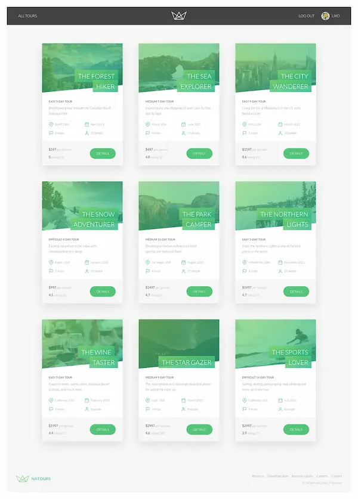

<div align="center">
  <br />
  <br />
  
  # <code>NATOURS</code>
  
  **BACKEND API / TOUR BOOKING PLATFORM**
  
  <br />

  
  
  

  <br />
  <br />
</div>

---

### 00 __ PREVIEW



> **ABSTRACT:** API RESTful completa para plataforma de reserva de tours. Implementa autenticación JWT, autorización basada en roles, gestión de imágenes con Sharp, rate limiting, sanitización de datos y server-side rendering con Pug. Sistema modular con Factory Pattern para operaciones CRUD.
>
> <br />
>
> **ORIGIN:** Based on [Node.js, Express, MongoDB & More](https://codingheroes.io/) by [Jonas Schmedtmann](https://codingheroes.io/).
> *Adapted with modern security practices, ES6+ patterns and production deployment on Render.*
>
> <br />
>
> **DEMO:** [https://natours-update-cursenode.onrender.com](https://natours-update-cursenode.onrender.com)

---

### 01 __ ARCHITECTURE & DECISIONS

| COMPONENT | TECH | NOTE |
| :--- | :--- | :--- |
| **Runtime** | `Node.js v18+` | Backend JavaScript runtime. |
| **Framework** | `Express 4.x` | Minimal web framework with middleware architecture. |
| **Database** | `MongoDB + Mongoose 8.x` | NoSQL with ODM for schema validation. |
| **Auth** | `JWT + bcryptjs` | Token-based authentication with encrypted passwords. |
| **Security** | `helmet + rate-limit + mongo-sanitize + hpp` | HTTP headers, DDoS protection, NoSQL injection prevention. |
| **Views** | `Pug 3.x` | Server-side templating engine. |
| **Bundler** | `esbuild` | Ultra-fast JavaScript bundler for client scripts. |
| **Email** | `Nodemailer + html-to-text` | Transactional emails with HTML/text versions. |
| **Images** | `Multer + Sharp` | Upload handling and image optimization. |
| **Deploy** | `Render` | Production environment with CI/CD. |

<br>

### 02 __ INSTALLATION

*Run local environment:*

```bash
# 1. Clone
git clone https://github.com/samuhlo-training/natours-update-cursenode.git

# 2. Install dependencies
npm install

# 3. Configure environment variables
# Create .config.env file with:
# - DATABASE (MongoDB connection string)
# - DATABASE_PASSWORD
# - JWT_SECRET
# - JWT_EXPIRES_IN
# - JWT_COOKIE_EXPIRES_IN
# - EMAIL_USERNAME, EMAIL_PASSWORD, EMAIL_HOST, EMAIL_PORT

# 4. Start development server
npm run dev

# 5. Build client bundle
npm run build:js
```

**Production:**
```bash
npm start
```

---

### 03 __ KEY FEATURES / SNIPPETS

#### A. FACTORY PATTERN FOR CRUD OPERATIONS
Handler genérico que elimina repetición en controladores.

```javascript
// handlerFactory.js
exports.deleteOne = (Model) =>
  catchAsync(async (req, res, next) => {
    const doc = await Model.findByIdAndDelete(req.params.id);
    if (!doc) {
      return next(new AppError('No document found with that ID', 404));
    }
    res.status(204).json({ status: 'success', data: null });
  });
```

#### B. ADVANCED AUTHENTICATION MIDDLEWARE
Protección de rutas con JWT y verificación de permisos.

```javascript
// authController.js
exports.protect = catchAsync(async (req, res, next) => {
  let token;
  if (req.headers.authorization?.startsWith('Bearer')) {
    token = req.headers.authorization.split(' ')[1];
  } else if (req.cookies.jwt) {
    token = req.cookies.jwt;
  }
  
  if (!token) return next(new AppError('You are not logged in', 401));
  
  const decoded = await promisify(jwt.verify)(token, process.env.JWT_SECRET);
  const currentUser = await User.findById(decoded.id);
  
  if (!currentUser) return next(new AppError('User no longer exists', 401));
  req.user = currentUser;
  next();
});
```

#### C. API FEATURES BUILDER
Clase utilitaria para filtrado, ordenación, limitación y paginación.

```javascript
// apiFeatures.js
class APIFeatures {
  filter() {
    const queryObj = { ...this.queryString };
    const excludedFields = ['page', 'sort', 'limit', 'fields'];
    excludedFields.forEach(el => delete queryObj[el]);
    
    let queryStr = JSON.stringify(queryObj);
    queryStr = queryStr.replace(/\b(gte|gt|lte|lt)\b/g, match => `$${match}`);
    this.query = this.query.find(JSON.parse(queryStr));
    return this;
  }
}
```

---

### 04 __ PROJECT STRUCTURE

```
controllers/     # Business logic & request handlers
models/          # Mongoose schemas (Tour, User, Review)
routes/          # Express route definitions
views/           # Pug templates for SSR
public/          # Static assets (CSS, client JS, images)
utils/           # Helper utilities (catchAsync, AppError, email)
dev-data/        # Seed data for development
```

---

### 05 __ DEMO CREDENTIALS

> **Email:** `admin@natours.io`  
> **Password:** `test1234`

---

<div align="center">

<br />

<code>DESIGNED & CODED BY <a href='https://github.com/samuhlo'>samuhlo</a></code>

<br />

<small>Lugo, Galicia</small>

</div>
